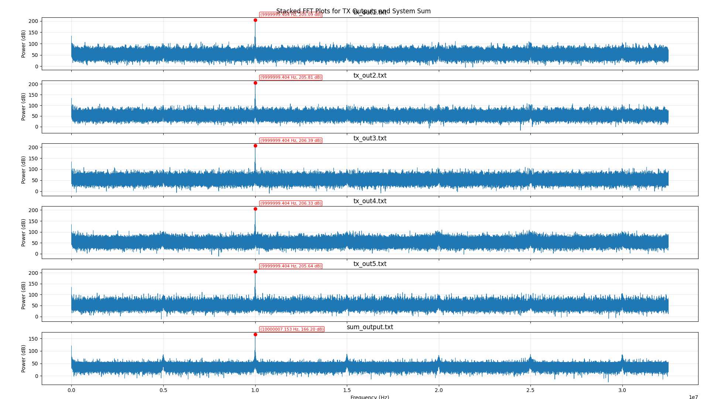

TB Uberclock Simulation Results
===============================

This testbench simulates our DSP datapath without CPU (`method 1 <https://github.com/chili-chips-ba/uberClock/blob/dev-5channel-fifo/0.doc/HW_architecture.png>`_). Test case feeds
one 10MHz sinewave into 5 channels. Each channel downconverts and downsamples the signal, adds gains, and then upsamples and upconverts. The output of the system is the sum of
all 5 channels that in real case represents the driving signal of he oscillator.

Channels mix down to baseband frequencies 500Hz, 1kHz, 1.5kHz, 2kHz and 2.5kHz. The result is then again the 10MHz, now with the expected gain.
Results were stored in files so we could take a look at time and freq. domains.

Waveforms of the 5 downconverted signals are shown in the picture below:

.. image:: https://github.com/user-attachments/assets/fc4d23f9-3811-49ac-b714-4428ee0ea6ae
   :alt: Five downconverted simulation waveforms
   :width: 100%

Their freq. domain matches the expected:

.. image:: ../../../../1.dsp/sim/results/Figure_2.png
   :alt: Downconverted channel FFT result
   :width: 100%

After upsampling and upconverting all signals are expected to be back to 10MHz, as well as their sum. Waveform are shown in the picture below.

.. image:: https://github.com/user-attachments/assets/64887026-6e66-4b11-8401-a530a4f75ee8
   :alt: Upsampled and upconverted simulation waveforms
   :width: 100%

The FFT analysis shows the expected result is achieved and 5 channels are working together in parallel. Each one can now be responsible for driving one mode of the XTAL.

