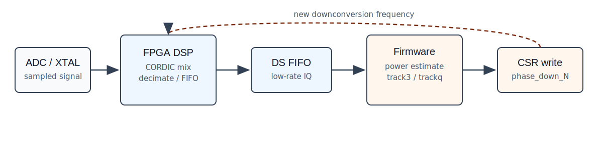
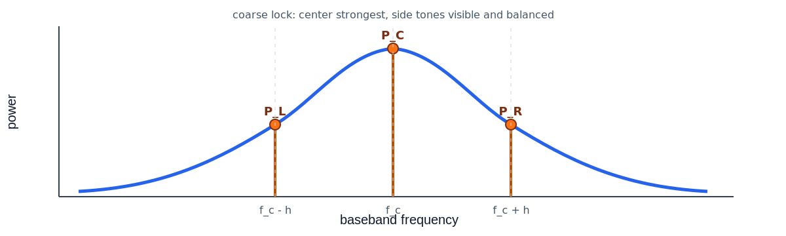
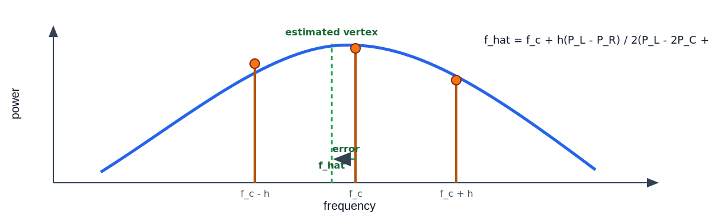

<!--
SPDX-FileCopyrightText: 2026 Ahmed Imamovic
SPDX-FileCopyrightText: 2026 Tarik Hamedovic
SPDX-FileCopyrightText: 2026 Dan Gisselquist
SPDX-License-Identifier: CC-BY-SA-4.0
-->

Tracking Algorithm
==================

The tracker is a small software loop wrapped around the FPGA DSP path. The FPGA
does the expensive, timing-sensitive work: CORDIC mixing, filtering,
downsampling, and FIFO movement. The firmware only sees a low-rate stream. It
measures where the tones landed, then writes a new ``phase_down_<channel>``
value through the LiteX CSRs.

That split is intentional. The signal path stays deterministic in RTL, while
the search rule can still be changed from C without resynthesizing the FPGA.

The current firmware has two tracking commands:

``track3``
   A coarse search. It sweeps one downconversion frequency until the expected
   three-tone shape is visible in the downsampled spectrum.

``trackq_start`` / ``trackq_stop``
   A fine tracker. Once the coarse point is close, it periodically measures the
   same three tones, estimates the peak offset, and nudges channels 1, 2, and 3.

Signal model
------------

During tracking the firmware injects, or expects to see, three tones around a
known baseband center:

.. math::

   f_L = f_c - h,\qquad f_C = f_c,\qquad f_R = f_c + h

Here ``f_c`` is usually 1 kHz and ``h`` is the per-channel spacing. The default
spacing is 10 Hz for channel 1 and 30 Hz for channels 2 and 3 in the
``trackq`` path.

The downconverter setting is a 26-bit phase increment. Firmware converts
between Hertz and the CSR value with:

.. math::

   \mathrm{phase\_inc}
      = \left\lfloor {f_{\mathrm{down}}\,2^{26} \over 65\,000\,000} \right\rfloor

and the inverse conversion used for prints is:

.. math::

   f_{\mathrm{down}}
      \approx { \mathrm{phase\_inc}\,65\,000\,000 \over 2^{26}}

So one LSB is just under 1 Hz.

Power measurement
-----------------

``track3`` runs a KISS FFT over a captured block and reads the bins nearest
``f_L``, ``f_C``, and ``f_R``. For a capture length ``N`` and downsampled rate
``F_s``:

.. math::

   k(f) = \mathrm{round}\left({fN \over F_s}\right)

The power in a complex FFT bin is:

.. math::

   P[k] = \Re\{X[k]\}^2 + \Im\{X[k]\}^2

For ``trackq`` the firmware uses a narrow correlator-style measurement on the
captured samples instead of relying on a single FFT bin.

.. math::

   I(f) = \sum_{n=0}^{N-1} x[n]\cos\left(2\pi {fn \over F_s}\right)

.. math::

   Q(f) = -\sum_{n=0}^{N-1} x[n]\sin\left(2\pi {fn \over F_s}\right)

.. math::

   P(f) = I(f)^2 + Q(f)^2

The code also measures one bin-width on either side and folds that into the
reported band power:

.. math::

   P_b(f) = P(f) + {P(f-\Delta f_{\mathrm{bin}}) + P(f+\Delta f_{\mathrm{bin}}) \over 2}

where:

.. math::

   \Delta f_{\mathrm{bin}} = {F_s \over N}

Coarse lock rule
----------------

The coarse search is deliberately conservative. A candidate point is accepted
only when the center tone is strongest and both side tones are present:

.. math::

   P_C > P_L,\qquad P_C > P_R

The side tones must also sit inside the acceptance window used by
``track3_triplet_match``:

.. math::

   0.02P_C \leq \min(P_L,P_R)

.. math::

   \max(P_L,P_R) \leq 0.95P_C

.. math::

   \min(P_L,P_R) \geq 0.40\max(P_L,P_R)

``track3`` coarse sweep
-----------------------

``track3`` starts from a requested downconversion frequency and walks forward
in fixed Hertz steps:

.. code-block:: text

   track3 <channel> <start_hz> [step_hz] [max_steps] [N] [center_hz] [delta_hz]

Typical setup:

.. code-block:: text

   fft_fs 10000
   track3 1 10002950 10 400 2048 1000 20

For each trial point it:

1. converts the candidate frequency to a ``phase_down`` increment,
2. writes the CSR and commits the update,
3. throws away a short settling window,
4. captures ``N`` downsampled samples from the selected channel,
5. measures ``P_L``, ``P_C``, and ``P_R``,
6. stops if the three-bin rule passes.

If no lock is found, the firmware restores the original phase increment.

Fine tracking with a three-point parabola
-----------------------------------------

Once the tones are close, ``trackq`` treats the three power values as samples of
a peak. With equally spaced samples at ``f_c-h``, ``f_c``, and ``f_c+h``, the
vertex estimate is:

.. math::

   \hat f
      = f_c
        + h {P_L - P_R \over 2(P_L - 2P_C + P_R)}

The denominator should be negative for a real peak. If it is not, the firmware
does not trust the parabola.

The measured baseband error is:

.. math::

   e = \hat f - f_c

The controller filters the error:

.. math::

   e_f[n] = e_f[n-1] + {1 \over 4}\left(e[n]-e_f[n-1]\right)

then applies a small proportional gain:

.. math::

   u[n] = {1 \over 4}e_f[n]

The fractional part is kept in an accumulator, and the integer-Hertz correction
is clamped before it is written back:

.. math::

   \Delta f_{\mathrm{down}}
      = \mathrm{clamp}\left(\left\lfloor u_{\mathrm{acc}} \right\rfloor,
        -2\,\mathrm{Hz}, +2\,\mathrm{Hz}\right)

Weak measurements
-----------------

Sometimes the three samples do not pass the full confidence test. The firmware
still tries to make a cautious correction if the side powers are clearly
unbalanced:

.. math::

   e_{\mathrm{weak}}
      \approx {P_R-P_L \over P_R+P_L}\,{h \over 4}

There is a deadband around zero side imbalance, and the weak-mode correction is
clamped to only 1 Hz.

Runtime cadence
---------------

``trackq`` is serviced from ``uberclock_poll``. The update interval is
``TRACKQ_INTERVAL_TICKS``, currently 20000 downsample ticks. With the usual
``fft_fs 10000`` setup, that is a two-second tracking update.

Each update captures the three tracked channels together:

.. code-block:: text

   trackq_start <f1> <f2> <f3> [N] [center_hz] [delta_ch1_hz] [delta_ch2_hz] [delta_ch3_hz]
   trackq_probe [N] [center_hz] [delta_hz]
   trackq_stop

``trackq_probe`` is the useful bench command when tuning. It runs one capture
and prints the three powers and the estimated vertex without waiting for the
periodic background log.

Example application
-------------------

The following example demonstrates how the tracking algorithm is used to lock
onto and continuously follow three resonant oscillator modes. Each mode can
drift over time because of temperature changes, aging, or other environmental
effects.

The workflow is divided into two stages:

1. ``track3`` performs a coarse search and locates the approximate resonance.
2. ``trackq_start`` begins continuous fine tracking using quadratic
   interpolation around the detected peak.

3 Tone Tracking
^^^^^^^^^^^^^^^

The tracking system positions the CPU-generated tones and CORDIC mixer
frequencies near the resonant frequency so that the fine tracker can maintain
lock on the moving peak.

C300 Mode
~~~~~~~~~

From lab measurements, this tone is expected in the following frequency range:

.. code-block:: text

   10.003840 MHz to 10.004000 MHz

The serial console interface is:

.. code-block:: text

   track3 <ch> <start_hz> [step_hz] [max_steps] [N] [center_hz] [delta_hz]

First coarse iteration:

.. code-block:: text

   uberClock> track3 1 10002840 20 10 2048 1000 20
   track3: ch=1 start=10002840 Hz step=20 Hz max_steps=10 N=2048 center=1000 Hz delta=20 Hz Fs=10000 Hz sig3={980,1000,1020} Hz
   track3 step=0 phase_down_1=10002840 Hz inc=10327372 bins={201,205,209} pwr={3535,554,323}
   track3 step=1 phase_down_1=10002860 Hz inc=10327393 bins={201,205,209} pwr={188,114,66}
   track3 step=2 phase_down_1=10002880 Hz inc=10327414 bins={201,205,209} pwr={51,33,42}
   track3 step=3 phase_down_1=10002900 Hz inc=10327434 bins={201,205,209} pwr={18,16,25}
   track3 step=4 phase_down_1=10002920 Hz inc=10327455 bins={201,205,209} pwr={15,25,25}
   track3 step=5 phase_down_1=10002940 Hz inc=10327476 bins={201,205,209} pwr={20,16,13}
   track3 step=6 phase_down_1=10002960 Hz inc=10327496 bins={201,205,209} pwr={16,32,17}
   track3 lock: phase_down_1=10002960 Hz inc=10327496 center=1000 left=980 right=1020

Second refinement iteration:

.. code-block:: text

   uberClock> track3 1 10002940 1 20 2048 1000 10
   track3: ch=1 start=10002940 Hz step=1 Hz max_steps=20 N=2048 center=1000 Hz delta=10 Hz Fs=10000 Hz sig3={990,1000,1010} Hz
   track3 step=0 phase_down_1=10002940 Hz inc=10327476 bins={203,205,207} pwr={60067,136499,18232}
   track3 step=1 phase_down_1=10002941 Hz inc=10327477 bins={203,205,207} pwr={75089,110155,16630}
   track3 step=2 phase_down_1=10002942 Hz inc=10327478 bins={203,205,207} pwr={67740,57706,12101}
   track3 step=3 phase_down_1=10002943 Hz inc=10327479 bins={203,205,207} pwr={74213,33618,10973}
   track3 step=4 phase_down_1=10002944 Hz inc=10327480 bins={203,205,207} pwr={94839,25360,12059}
   track3 step=5 phase_down_1=10002945 Hz inc=10327481 bins={203,205,207} pwr={129631,16819,4922}
   track3 step=6 phase_down_1=10002946 Hz inc=10327482 bins={203,205,207} pwr={4352,25171,68193}
   track3 step=7 phase_down_1=10002947 Hz inc=10327483 bins={203,205,207} pwr={6651,34312,72923}
   track3 step=8 phase_down_1=10002948 Hz inc=10327484 bins={203,205,207} pwr={9542,69438,91629}
   track3 step=9 phase_down_1=10002949 Hz inc=10327485 bins={203,205,207} pwr={8819,71914,90698}
   track3 step=10 phase_down_1=10002950 Hz inc=10327486 bins={203,205,207} pwr={8676,69903,84677}
   track3 step=11 phase_down_1=10002951 Hz inc=10327487 bins={203,205,207} pwr={10158,62017,76351}
   track3 step=12 phase_down_1=10002952 Hz inc=10327488 bins={203,205,207} pwr={15947,54087,63095}
   track3 step=13 phase_down_1=10002953 Hz inc=10327489 bins={203,205,207} pwr={24303,54736,49692}
   track3 lock: phase_down_1=10002953 Hz inc=10327489 center=1000 left=990 right=1010

A100 Mode
~~~~~~~~~

Expected frequency range:

.. code-block:: text

   6.261641 MHz to 6.271641 MHz

Example coarse lock:

.. code-block:: text

   uberClock> track3 2 6261000 1000 10 2048 1000 100
   track3: ch=2 start=6261000 Hz step=1000 Hz max_steps=10 N=2048 center=1000 Hz delta=100 Hz Fs=10000 Hz sig3={900,1000,1100} Hz
   track3 step=0 phase_down_2=6261000 Hz inc=6464132 bins={184,205,225} pwr={0,108,0}
   track3 step=1 phase_down_2=6262000 Hz inc=6465164 bins={184,205,225} pwr={0,74,0}
   track3 step=2 phase_down_2=6263000 Hz inc=6466197 bins={184,205,225} pwr={0,106,0}
   track3 step=3 phase_down_2=6264000 Hz inc=6467229 bins={184,205,225} pwr={0,93,0}
   track3 step=4 phase_down_2=6265000 Hz inc=6468262 bins={184,205,225} pwr={0,99,0}
   track3 step=5 phase_down_2=6266000 Hz inc=6469294 bins={184,205,225} pwr={0,105,0}
   track3 step=6 phase_down_2=6267000 Hz inc=6470326 bins={184,205,225} pwr={0,95,0}
   track3 step=7 phase_down_2=6268000 Hz inc=6471359 bins={184,205,225} pwr={77,95,97}
   track3 step=8 phase_down_2=6269000 Hz inc=6472391 bins={184,205,225} pwr={96,69,121}
   track3 step=9 phase_down_2=6270000 Hz inc=6473424 bins={184,205,225} pwr={105,130,67}
   track3 lock: phase_down_2=6270000 Hz inc=6473424 center=1000 left=900 right=1100

C100 Mode
~~~~~~~~~

Expected frequency range:

.. code-block:: text

   3.388438 MHz to 3.388594 MHz

Example lock:

.. code-block:: text

   uberClock> track3 3 3387400 10 10 2048 1000 20
   track3: ch=3 start=3387400 Hz step=10 Hz max_steps=10 N=2048 center=1000 Hz delta=20 Hz Fs=10000 Hz sig3={980,1000,1020} Hz
   track3 step=0 phase_down_3=3387400 Hz inc=3497301 bins={201,205,209} pwr={14621,15243,11202}
   track3 step=1 phase_down_3=3387410 Hz inc=3497311 bins={201,205,209} pwr={13495,13321,9311}
   track3 step=2 phase_down_3=3387420 Hz inc=3497321 bins={201,205,209} pwr={14570,10784,7988}
   track3 step=3 phase_down_3=3387430 Hz inc=3497331 bins={201,205,209} pwr={12620,9838,7987}
   track3 step=4 phase_down_3=3387440 Hz inc=3497342 bins={201,205,209} pwr={10305,8390,8350}
   track3 step=5 phase_down_3=3387450 Hz inc=3497352 bins={201,205,209} pwr={10714,9075,7482}
   track3 step=6 phase_down_3=3387460 Hz inc=3497362 bins={201,205,209} pwr={8867,9387,6490}
   track3 lock: phase_down_3=3387460 Hz inc=3497362 center=1000 left=980 right=1020

Continuous Tracking
^^^^^^^^^^^^^^^^^^^

Once the initial coarse locks are found, continuous tracking is started with:

.. code-block:: text

   trackq_start <f1> <f2> <f3> [N] [center_hz] [delta_ch1_hz] [delta_ch2_hz] [delta_ch3_hz]

Example:

.. code-block:: text

   uberClock> trackq_start 10002953 6270000 3387460 2048 1000 10 100 20
   trackq_start: ch1=10002953 Hz ch2=6270000 Hz ch3=3387459 Hz N=2048 center=1000 Hz delta={10,100,20} Hz sig3={{990,1000,1010},{900,1000,1100},{980,1000,1020}} Hz interval=2 s
   trackq hf vertex: ch1=10003952.591Hz ch2=6270999.743Hz ch3=3388454.227Hz
   trackq hf vertex: ch1=10003952.591Hz ch2=6270989.468Hz ch3=3388449.384Hz
   trackq hf vertex: ch1=10003952.591Hz ch2=6270977.848Hz ch3=3388445.509Hz
   trackq hf vertex: ch1=10003951.622Hz ch2=6270966.016Hz ch3=3388444.541Hz
   trackq hf vertex: ch1=10003950.059Hz ch2=6270960.719Hz ch3=3388443.572Hz
   trackq hf vertex: ch1=10003949.441Hz ch2=6270955.188Hz ch3=3388442.604Hz
   trackq hf vertex: ch1=10003949.540Hz ch2=6270953.199Hz ch3=3388441.635Hz
   trackq hf vertex: ch1=10003949.685Hz ch2=6270951.865Hz ch3=3388441.635Hz
   trackq hf vertex: ch1=10003949.685Hz ch2=6270945.502Hz ch3=3388437.761Hz
   trackq hf vertex: ch1=10003949.685Hz ch2=6270945.502Hz ch3=3388436.792Hz
   trackq hf vertex: ch1=10003949.685Hz ch2=6270868.985Hz ch3=3388412.578Hz

Using the `low-speed debug signal capture <https://chili-chips-ba.github.io/uberClock/examples/capture_low_speed.html>`__,
the three tracking tones can be observed directly in the FPGA debug channels.

The tracker attempts to keep the central 1 kHz tone aligned with the
interpolated resonance peak.

.. image:: https://github.com/user-attachments/assets/82087cb3-5908-431e-bf4a-6906a9e5142a
   :width: 100%
   :alt: Low-speed debug capture, channel 1

.. image:: https://github.com/user-attachments/assets/40db3eaf-0d2a-4aa4-aaa0-b3759c2dc776
   :width: 100%
   :alt: Low-speed debug capture, channel 2

.. image:: https://github.com/user-attachments/assets/994bdcf5-0955-47ed-9a82-b9ecc0bc589a
   :width: 100%
   :alt: Low-speed debug capture, channel 3

All three resonant modes, corresponding to 9 tones in total, can also be
observed with the
`high-speed DDR3 debug capture <https://chili-chips-ba.github.io/uberClock/examples/capture_high_speed_ddr3.html>`__.

.. image:: https://github.com/user-attachments/assets/3cdd1d4f-3b93-4424-8c77-231ab8801f41
   :width: 100%
   :alt: High-speed debug capture showing all three modes

What to watch while testing
---------------------------

The tracker is only as good as the low-rate spectrum it sees. Before trusting
``trackq``, check these points:

- ``fft_fs`` must match the actual downsampled sample rate.
- ``N`` must be a power of two and no larger than 2048.
- The center and side tones must be below Nyquist.
- The side spacing should be large enough to measure a slope, but not so large
  that the side tones stop representing the same resonance peak.
- A coarse ``track3`` lock should show a center tone above both side tones, with
  both side tones still visible.

The code is simple on purpose. It is not a full PLL and it is not trying to
model the crystal. It is a measurement loop: look at three nearby points,
decide which way the peak moved, and make a small CSR update.
