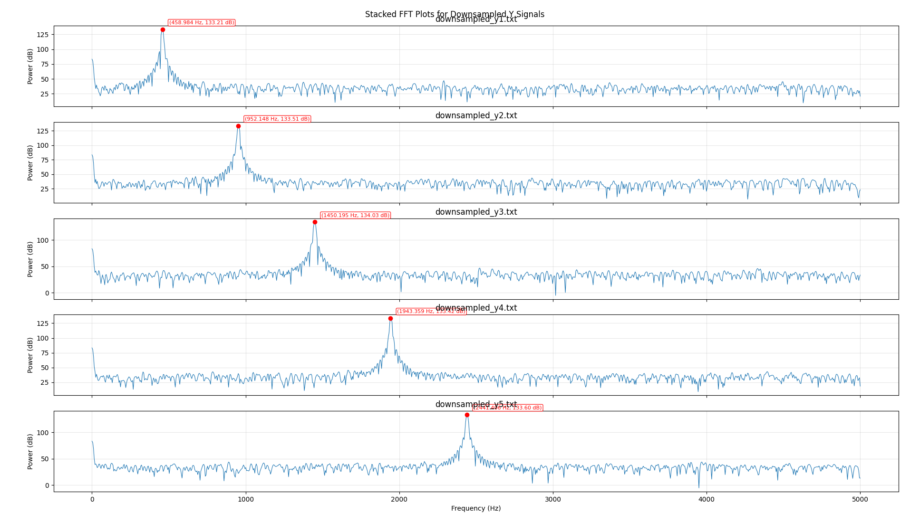

<!--
SPDX-FileCopyrightText: 2026 Tarik Hamedovic
SPDX-License-Identifier: CC-BY-SA-4.0
-->

uberClock RTL Simulation
========================

Two simulation paths live under ``2.soc/4.sim``:

``litex/``
   LiteX SoC simulation support. This is the preferred path for testing the
   CPU, CSR map, interrupts, FIFO bridges, and firmware-visible uberClock
   integration.

``uberclock/``
   Standalone imported RTL testbench and reference result bundle. This is useful
   for DSP-only waveform checks.

LiteX SoC Simulation
--------------------

The LiteX simulation target is implemented by ``uberclock_soc.sim`` and uses
the canonical RTL from ``2.soc/1.hw/uberclock`` and ``1.dsp/rtl``. Simulation
support files, including the Xilinx ``IDDR``/``ODDR`` behavioral models used by
the ADC/DAC wrappers, are stored in ``2.soc/4.sim/litex``.

Build the Verilator simulation without running it:

.. code-block:: console

   cd 3.build
   make sim-soc

Build and run non-interactively:

.. code-block:: console

   cd 3.build
   make sim-soc-run

The direct module invocation is:

.. code-block:: console

   PYTHONPATH=2.soc/8.python/src:$PYTHONPATH \
   CFLAGS=-Wno-error=incompatible-pointer-types \
   /home/hamed/FPGA/Tools/litex-hub/litex/litex-venv/bin/python3 -m uberclock_soc.sim \
     --with-uberclock \
     --build \
     --no-run \
     --output-dir=3.build/build/sim

Use ``--ram-init=<firmware.bin>`` when a firmware image should be preloaded
into integrated main RAM for a firmware-driven simulation run.

For non-interactive waveform captures, pass
``--trace`` and ``--finish-after-cycles=<cycles>`` or use ``make sim-soc-run``.
Without tracing enabled, LiteX can create a header-only ``sim.vcd`` that GTKWave
reports as having a zero time range.

Standalone RTL Bundle
---------------------

The standalone uberClock RTL simulation bundle is stored in
``2.soc/4.sim/uberclock``. It archives the imported ``tb_uberclock`` testbench,
the coefficient memories used by the filters, a simulation-local RTL snapshot,
the captured text traces, and plotting scripts.

The simulation-local ``src`` directory is intentionally treated as a snapshot.
The canonical production RTL remains in ``1.dsp/rtl`` and
``2.soc/1.hw/uberclock``. Use the canonical tree for source changes, then
refresh the simulation snapshot when the standalone testbench needs to be
reproduced with those changes.

Simulation Layout
-----------------

``tb_uberclock.v``
   Drives the standalone ``uberclock`` top, generates a 200 MHz differential
   reference clock, applies reset, programs five downconversion phase
   increments, and captures NCO, receive, transmit, and summed output traces.

``filelist.f``
   Lists the simulation RTL snapshot and testbench in compile order.

``*.mem``
   Filter coefficient memories. The RTL loads these with bare filenames through
   ``$readmemb()``, so run the simulator from ``2.soc/4.sim/uberclock``.

``results/``
   Imported reference traces, plots, and plotting scripts.

Running the Testbench
---------------------

From ``2.soc/4.sim/uberclock``:

.. code-block:: console

   iverilog -g2012 -o tb_uberclock.vvp -f filelist.f
   vvp tb_uberclock.vvp

The testbench writes fresh ``*.txt`` traces in the current working directory.
Keep the imported reference traces under ``results/`` separate from newly
generated output when comparing runs.

Reference Plots
---------------

The imported result bundle includes plots generated from the captured receive
and transmit traces.

.. image:: ../../../../2.soc/4.sim/uberclock/results/Figure_1.png
   :alt: Imported uberClock simulation plot figure 1
   :width: 100%

