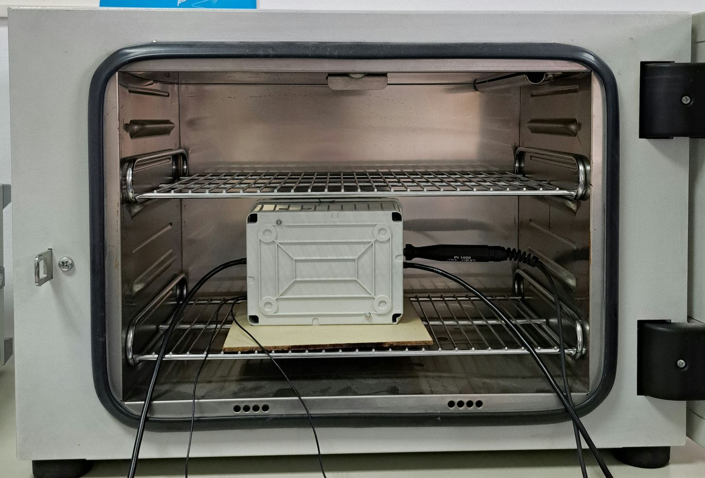
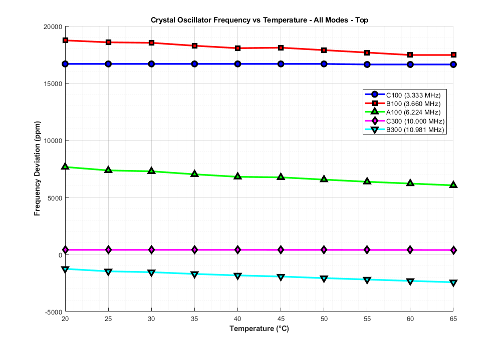
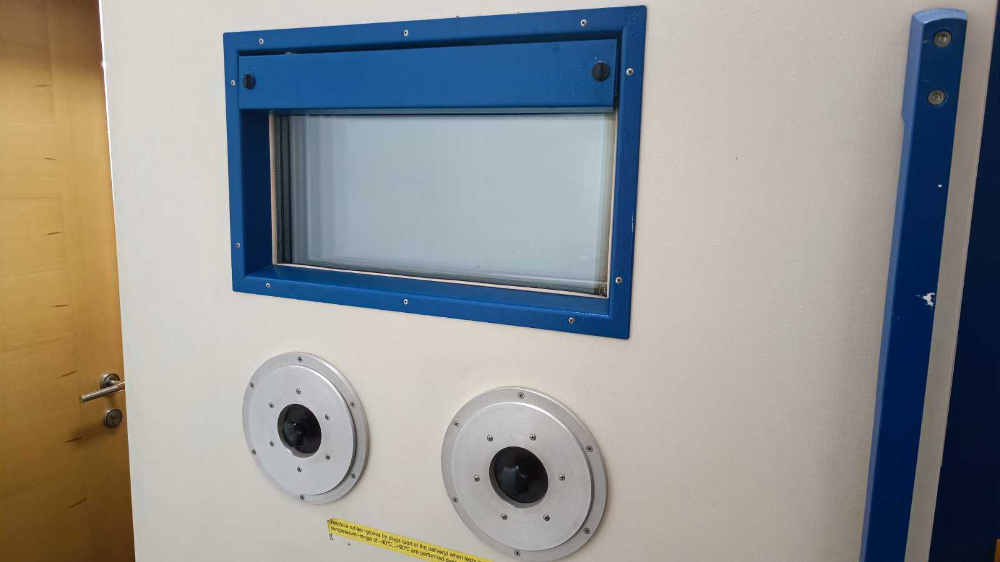
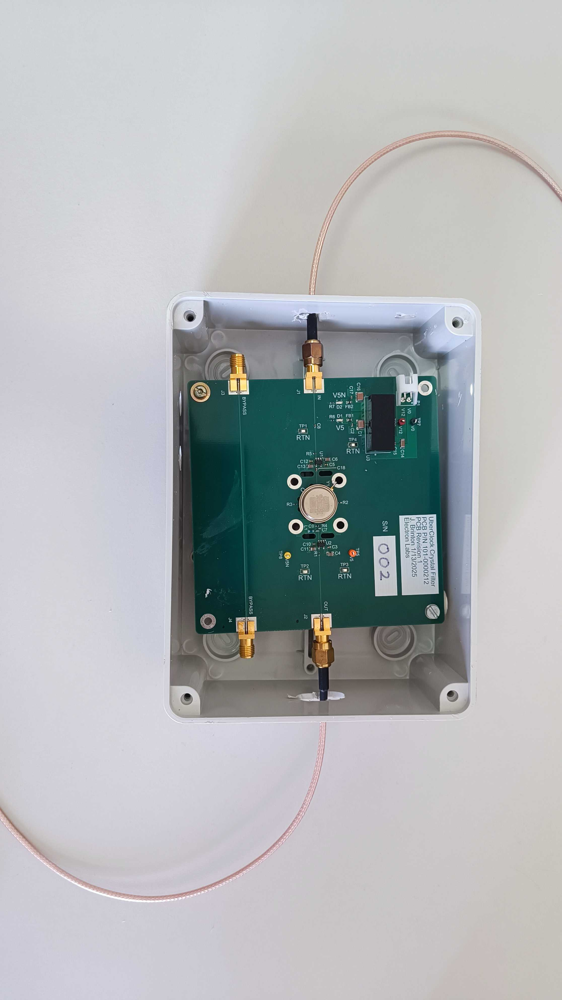

# Resonant Frequency Analysis: Temperature and Orientation Effects

This repository contains the dataset for the [**uberClock**](https://github.com/chili-chips-ba/uberClock) project, focusing on characterizing the resonant frequency of a crystal oscillator. The analysis investigates the impact of varying temperatures and different physical orientations of the board on the oscillator's stability across several vibration modes.

All measurements were performed using a Vector Network Analyzer (VNA), with raw data saved in `.s2p` format.

## Directory Structure

The repository is organized into two main parts: the raw, untouched measurement data, and the analysis outputs.

```
uberClock-data/
├── 0.doc/            # Supporting documents and figures
├── 1.raw_data/       # Raw .s2p files and VNA screenshots
├── 2.analysis/       # Analysis outputs
└── README.md         # This file
```

### `raw_data`

This directory contains the original measurement data, organized by a `ORIENTATION/MODE/TEMPERATURE` hierarchy. Each measurement consists of a :
* **`.s2p` file**: The S-parameter data from the VNA.

### File Format: S-Parameters (.s2p)

The `.s2p` files contain raw S-parameter data in a text-based format. The header, typically `# Hz S dB R 50.000`, indicates a frequency in Hertz, S-parameters, a magnitude in decibels, and a 50-ohm reference impedance.

Each row in the file contains nine columns of data:

1.  Frequency
2.  $S_{11}$ Magnitude
3.  $S_{11}$ Angle
4.  **$S_{21}$ Magnitude**
5.  **$S_{21}$ Angle**
6.  $S_{12}$ Magnitude
7.  $S_{12}$ Angle
8.  $S_{22}$ Magnitude
9.  $S_{22}$ Angle

For this analysis, we focused on the **$S_{21}$ parameter**, which represents the **insertion loss**. We used the **frequency (column 1)** and the **$S_{21}$ magnitude (column 4)** to find the resonant peaks of the oscillator.


**Example Path:**
```
1.raw_data/1.Top/1.C100/C100_25C.s2p
```

### `analysis`
This directory holds all the post-processing outputs, including plots and summary statistics.

* `plots/`: Contains plots showing the parts-per-million (ppm) frequency deviation versus temperature for a specific mode.
* `summaries/`: Contains text files with some summary statistics for each orientation, like the example below.

```
SUMMARY STATISTICS
C100 Mode (3.333 MHz nominal):
Temperature range: 20°C to 65°C (10 points)
Frequency range: 3.388438 to 3.388594 MHz
PPM deviation range: 16633.06 to 16679.87 ppm
PPM standard deviation: 22.61 ppm
Linear temperature coefficient: -1.191 ppm/°C
```


## Measurement Details

Measurements were conducted across a temperature range of **20°C to 65°C**, in **5°C increments**.

### Expected Vibration Modes

| Mode  | Approximate Frequency |
| :---- | :-------------------- |
| C100  | 3.333 MHz             |
| B100  | 3.660 MHz             |
| A100  | 6.224 MHz             |
| C300  | 10.000 MHz            |
| B300  | 10.981 MHz            |

### Measured Resonant Frequencies

This table shows the measured resonant frequencies for each mode at every temperature tested.

| Temperatura | Mode C100 (3.333 MHz) | Mode B100 (3.660 MHz) | Mode A100 (6.224 MHz) | Mode C300 (10.000 MHz) | Mode B300 (10.981 MHz) |
|:-----------:|:----------------------|:----------------------|:----------------------|:-----------------------|:-----------------------|
| **20°C** | 3.388594 MHz          | 3.728594 MHz          | 6.271641 MHz          | 10.004000 MHz          | 10.967090 MHz          |
| **25°C** | 3.388594 MHz          | 3.727969 MHz          | 6.269781 MHz          | 10.004000 MHz          | 10.964730 MHz          |
| **30°C** | 3.388594 MHz          | 3.727813 MHz          | 6.269281 MHz          | 10.003990 MHz          | 10.963910 MHz          |
| **35°C** | 3.388594 MHz          | 3.726875 MHz          | 6.267656 MHz          | 10.003980 MHz          | 10.962210 MHz          |
| **40°C** | 3.388594 MHz          | 3.726094 MHz          | 6.266289 MHz          | 10.003960 MHz          | 10.960810 MHz          |
| **45°C** | 3.388594 MHz          | 3.726250 MHz          | 6.266000 MHz          | 10.003950 MHz          | 10.959730 MHz          |
| **50°C** | 3.388594 MHz          | 3.725469 MHz          | 6.264766 MHz          | 10.003930 MHz          | 10.958190 MHz          |
| **55°C** | 3.388438 MHz          | 3.724688 MHz          | 6.263594 MHz          | 10.003900 MHz          | 10.956860 MHz          |
| **60°C** | 3.388438 MHz          | 3.723906 MHz          | 6.262617 MHz          | 10.003870 MHz          | 10.955510 MHz          |
| **65°C** | 3.388438 MHz          | 3.723906 MHz          | 6.261641 MHz          | 10.003840 MHz          | 10.954230 MHz          |

---

### Board Orientations

To analyze the effects of gravity and physical stress, measurements were taken in six distinct spatial orientations. The name of each orientation corresponds to the side of the box that is facing upward.

**Orientation Diagram:**

The image below clarifies the naming convention for each side.

<p align="center">
  
</p>


| Orientation Name  | Description                             |
| :---------------- | :-------------------------------------- |
| `Top`             | The side labeled **TOP** is facing up   |
| `Bottom`          | The side labeled **BOTTOM** is facing up|
| `Front`           | The side labeled **FRONT** is facing up |
| `Back`            | The side labeled **BACK** is facing up  |
| `Right`           | The side labeled **RIGHT** is facing up |
| `Left`            | The side labeled **LEFT** is facing up  |

**Example Images from the Lab:**

To provide a visual reference for our orientation setup, here are three pictures of the measurement box in different positions. From left to right, the images show the box in the Top, Front, and Back orientations.

<p align="center">
  
  
  
</p>


## Analysis and Goals

The primary objective of this analysis is to track and quantify the frequency shift of each resonant mode under varying thermal and gravitational conditions.

The workflow involves:
1.  **Parsing `.s2p` files** to extract the frequency response for each measurement point.
2.  **Identifying the peak resonant frequency** from the data.
3.  **Calculating the frequency deviation in parts-per-million (ppm)** to normalize the results for comparison. The deviation is calculated relative to a reference frequency ($f_{\text{ref}}$)

<p align="center">
    $\text{ppm} = \frac{f(T) - f_{\text{ref}}}{f_{\text{ref}}} \times 10^6$
</p>

**Example Result:**

The analysis folder contains visualizations generated from this process. For example, a plot showing frequency deviation versus temperature for a Top Orientation is shown below.



## Test Equipment

<p align="center">
  
  
  </br>
  
  </br>
  
  </br>
  
  
  </br>
  
  
  
  </br>
</p>

- [OctoClock-G CDA-2990](https://www.ettus.com/all-products/octoclock-g/)
  
### End-of-Document
